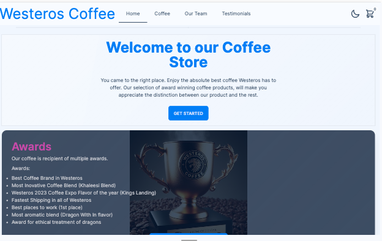
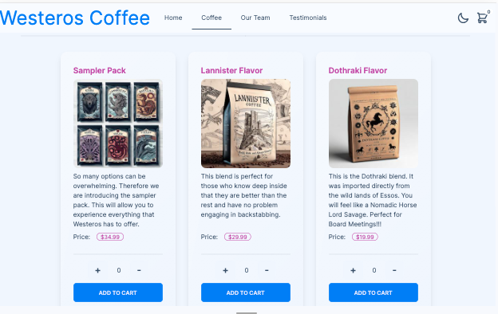
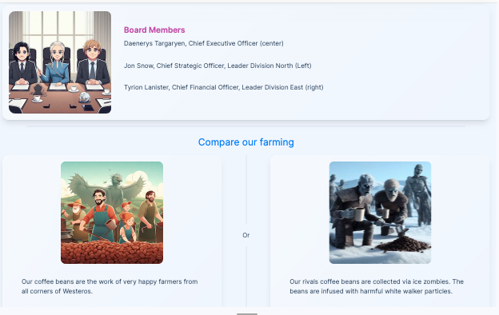
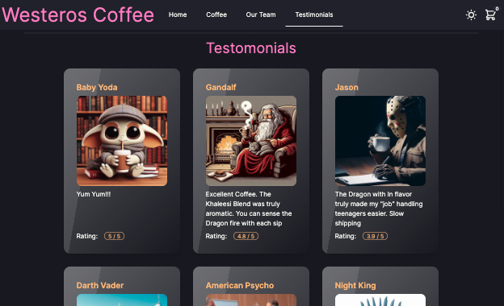

# Westeros Coffee Store

[](https://opensource.org/licenses/MIT)

## Description

This is the Westeros Coffee shop. It is a Game of Thrones inspired mock store. It is meant as a showcase of my work. If you enjoy my humor and creativity feel free to contact me and hire me.

## Table of Contents

- [Installation](#installation)
- [Usage](#usage)
- [ScreenShot](#screenshot)
- [License](#license)
- [Contributing](#contributing)
- [Tests](#tests)
- [Questions](#questions)

## Installation

```bash
npm run install
npm run build
npm run start
```

## Usage

It is meant to be viewed online. Please visit it's site.

## ScreenShots

Home



Coffee Store



Team Members



Testimonials (Dark mode)



## License

This project is covered under the following: MIT License

## Contributing

Submit a GitHub Issue.

## Tests

N/A

## Questions

Submit a GitHub Issue

Github User Name: rbarbosa51

Github Profile URL: https://github.com/rbarbosa51
